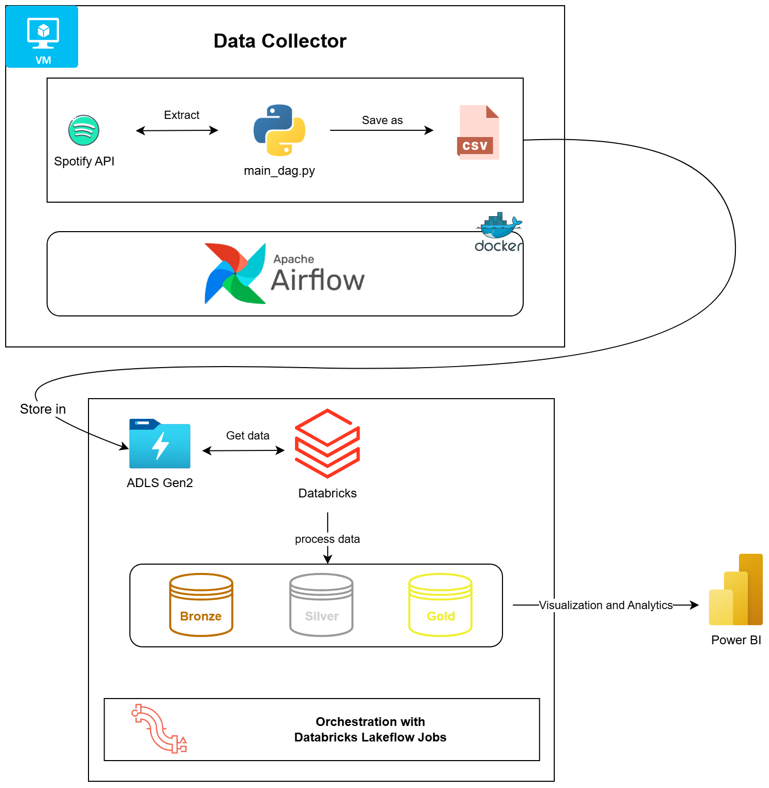

# Spotify "Wrapped" me

😞 Sad cuz no one **wrapped** their arms around you?  

👉 Don't worry! Spotify got you!

# About
**SpotifyWrapped** analyzes and tracks your Spotify statistics and listening habits. It replicates the real SpotifyWrapped but in a narrower interval. 
A data pipeline that is scheduled to get data from your Spotify, extract the data, load the raw data and perform transformation (ELT).

# Techstack

- Data sources - [Spotify API](https://developer.spotify.com/documentation/web-api) and your [Spotify Extended Streaming History](https://www.spotify.com/us/account/privacy/)
- Data collector - Azure VM + Docker + Airflow
- Data Storage - Azure Data Lake Storage Gen2
- Processor - Azure Databricks
- Orchestration - Databricks [Lakeflow Jobs](https://www.databricks.com/product/data-engineering/lakeflow-jobs) (formerly known as *Databricks Workflows*)
- Language - Python + PySpark

# Architecture

# Flow

1. A separate VM is set up to collect data from Spotify hourly by using **Airflow** image in Docker. The output data is in **.csv** files. 
2. CSV files and Extended Streaming History are then uploaded to ADLS Gen2 for processing. 
3. In Databricks, the **Medallion Architecture** is followed. Since this is a Student account -> **Unity Catalog** is not enabled, thus we will use the **Legacy Hive Metastore**.

 
4.  How medallion architecture works:
    - In the **bronze layer**, we are using **AutoLoader** to incrementally load the files.
    - In the **silver layer**, data is be sanitized and is made ready for use. 
    - In the **gold layer**, aggregation is performed, where the aggregated data will be fed to Power BI for visualization and analytics *(tbd)*. 

# Set up
- Get started with Spotify Web API - [Setup](./setup/spotify_api.md)

- Create services in Azure Portal - [Setup](./setup/azure.md) 

- Azure VM + Docker + Airflow setup to collect Spotify API data - [VM setup](./setup/azure.md/#azure-vm) and [Docker + Airflow setup]()

# Future plan

- Find substitution for Azure VM where data can be extracted 24/7.
- Implement CI/CD. 
- Process automation: enter the client id and secret in terminal -> automatically create a .env file in python
- If a task is failed during the process, a notification will be sent to Slack channel. Additionally, a summary will be sent weekly to Slack (_tbd_).