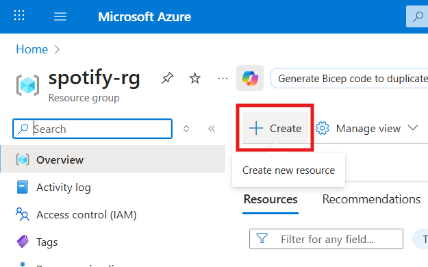
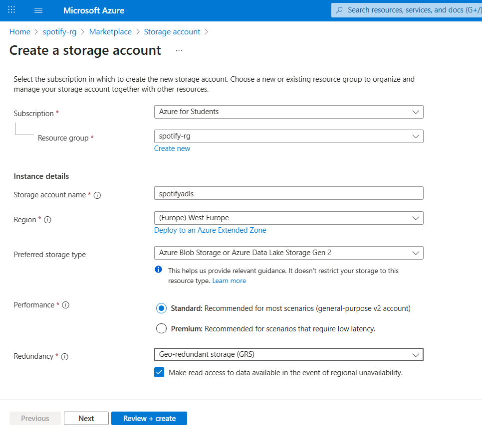
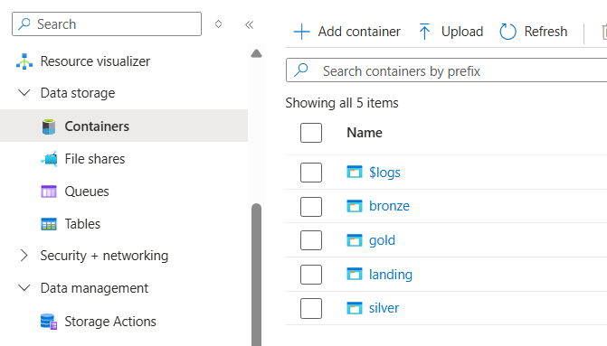
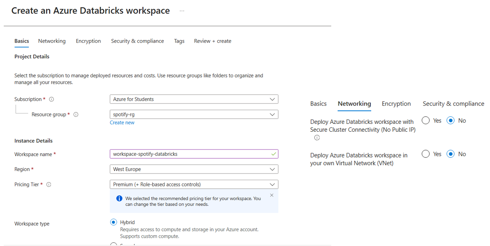

# Create Azure account

It is mandatory to have an Azure account to work with Azure (services). Thus, you will need one.

👉 Create one by yourself. In this project, I'm signing up as a **student account**.

# Azure resource group

In Azure, there are tons of services. Therefore, it is handy to create the `resource group` first to easily manage the `resources`.

After the `resource group` is created, we can add resources into the group.

In this project, the `services` to be added include:

- Key vault
- Azure Virtual Machine
- Storage account (ADLS Gen2)
- Databricks

# Azure Data Lake Storage Gen2

In the resource group, create `Storage account`.

In `Advanced` tab, tick `Enable hierarchical namespace`. If you don't choose this opiton, you'll end up getting a **blob storage**.  
More info at [ADLS Gen2 Overview](https://www.youtube.com/watch?v=McJj_N-pjgI).

## Initial setup

Initially, in this storage, we will create 4 containers (folders) for later use. These containers follow the **Medallion Architecture**.

- **landing**: contains the raw data from sources.
  > **Note that**: in other scenarios, this _landing folder_ is **optional** as raw data can be extracted straight from source -> bronze.
- **bronze**: raw data + time_ingested
- **silver**: bronze + cleansing + validation etc ...
- **gold**: aggregated data, ready to be pushed to dashboards for analytics.

# Databricks

In the resource group, create `Databricks` with the following setting (the remaining will be set as default):

## Hive Metastore

> Physical Layer: Data sits in ADLS Gen2 containers/folders. \
> Logical Layer: (External) tables are defined in the Hive Metastore pointing to those ADLS paths.

In each layer, create a corresponding **database** for later tables.

# Azure VM

In the resource group, create `Virtual Machine`. The configuration in this setup is a bit long, so I put into a video tutorial.

Link to [video VM setup](https://www.youtube.com/watch?v=2cz8a_wtX6w&t=351s).

> Due to some cost limitations, the Azure VM I created is only 4GB RAM, which means the Docker + Airflow configuration needs to be closely modified to fit right in.

Read more about Azure VM: https://learn.microsoft.com/en-us/azure/architecture/reference-architectures/n-tier/linux-vm
