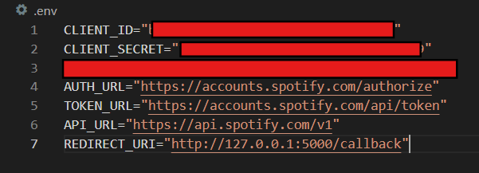

# Getting started 
## Set up your Spotify account
- Create an app in [Spotify Dashboard](https://developer.spotify.com/dashboard) with the following information
  - **App name:** Spotify Processing
  - **App description:** An app to process with user's Spotify data
  - **Redirect URIs:** these URIs are the ones that enable Spotify authentication service to automatically relaunch the app everytime the user logs in. In this case, we set as: http://127.0.0.1:5000/callback.
> **TLDR**: user log in -> authorization -> get back to this *redirect URI*. <br> At this stage, there will be a function to handle in case user accepts or rejects the authorization.  

## Add environment configuration to your workspace
- In this root directory *(SpotifyWrapped/)*, create an `.emv` file that contains your personal Spotify information as follows:
  ```py
  CLIENT_ID="<your_client_id>"
  CLIENT_SECRET="<your_client_secret>"
  AUTH_URL="https://accounts.spotify.com/authorize"
  TOKEN_URL="https://accounts.spotify.com/api/token"
  API_URL="https://api.spotify.com/v1"
  REDIRECT_URI="http://127.0.0.1:5000/callback"
  ```



